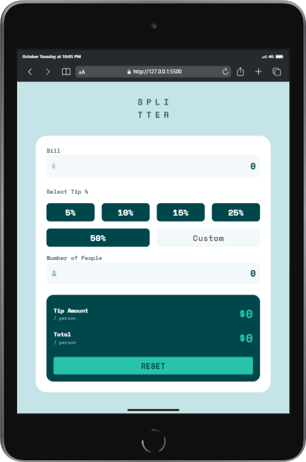

# Tip Calculator App

This is a responsive **Tip Calculator App** project, completed as a challenge from [Frontend Mentor](https://www.frontendmentor.io). The app allows users to calculate the total tip and cost per person based on the bill amount, selected tip percentage, and the number of people. It includes preset tip percentages, a custom tip input, and a reset functionality.

## Table of Contents

- [Features](#features)
- [Screenshots](#screenshots)
- [Getting Started](#getting-started)
- [Usage](#usage)
- [Technologies Used](#technologies-used)
- [Acknowledgments](#acknowledgments)

## Features

- **Bill Input**: Enter the total bill amount.
- **Tip Selection**: Choose from preset tip percentages (5%, 10%, 15%, 25%, 50%) or enter a custom tip amount.
- **People Count**: Input the number of people sharing the bill.
- **Instant Calculation**: See the calculated tip per person and total per person in real time.
- **Reset Button**: Clears all input fields and results.

## Screenshots
### Website Preview on Laptop

Here are some previews of the website on a Laptop:


### Website Preview on Tablet

Here are some previews of the website on a Tablet:




### Website Preview on Phone

Here are some previews of the website on a phone:

<div style="display: flex; justify-content: center; flex-wrap: wrap;">
    
    
</div>

## Getting Started

To get a local copy up and running, follow these steps:

### Prerequisites

- **Code Editor**: Use a code editor like [VS Code](https://code.visualstudio.com/) to view and edit the code.
- **Browser**: A modern browser like Chrome, Firefox, Safari, or Edge.

### Installation

1. Clone the repository:
   ```bash
   git clone https://github.com/your-username/tip-calculator-app.git
   ```
2. Navigate to the project folder:
```bash
cd tip-calculator-app
```
3. Open `index.html` in your preferred browser to view the app.

### Usage

1. Enter the bill amount in the "Bill" field.
2. Select a tip percentage or enter a custom tip percentage.
3. Input the number of people.
4. The app automatically calculates the __Tip Amount__ and __Total__ per person based on your entries.
5. Use the __Reset__ button to clear all inputs and calculated values.

### Technologies Used

- __HTML:__ Structure of the app.
- __CSS:__ Styling for layout, colors, and responsiveness.
- __JavaScript:__ Calculation logic for tip and total amounts.

### Acknowledgments

- This project is part of a coding challenge by Frontend Mentor, which provides fun challenges to improve coding skills.
- Special thanks to Frontend Mentor for providing the challenge and layout inspiration.